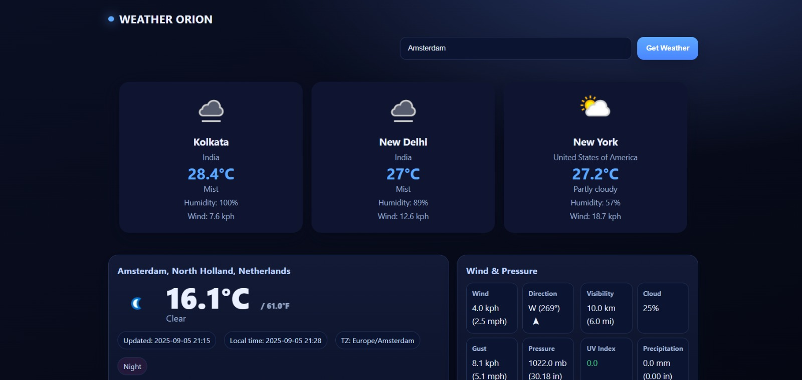

# Weather-Orion

A simple and modern **Weather Web App** built with **HTML, CSS, and JavaScript**, powered by the **[WeatherAPI](https://www.weatherapi.com/).**

### ✨ Features
- Search weather by **city name** or **latitude/longitude**
- View detailed data: **temperature, conditions, humidity, wind, pressure, UV index**, and more
- See **default weather cards** for *Kolkata, New Delhi, and New York* on initial load
- **Responsive and lightweight** for fast performance

### 🚀 Live Demo
[Weather Orion](https://parthajit3080.github.io/Weather-Orion/)

###🛠️ Tech Stack

- Frontend: HTML, CSS, JavaScript
- API: WeatherAPI

### 🔧 Setup & Usage

- Clone this repository
-- git clone https://github.com/your-username/your-repo-name.git
cd your-repo-name

- Open in browser
-- Just open index.html in your browser.

- Update API Key
--Replace the placeholder API_KEY in script.js with your own WeatherAPI key
.

### 📂 Project Structure
- ├── index.html       # Main HTML file
- ├── style.css        # CSS styling
- ├── script.js        # JavaScript logic
- ├── README.md        # Project documentation

### 🙌 Acknowledgements

- Weather data powered by WeatherAPI
- Inspired by simple & clean weather app designs
